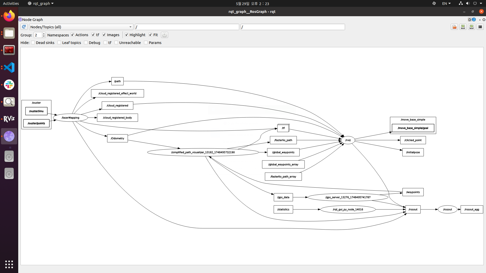
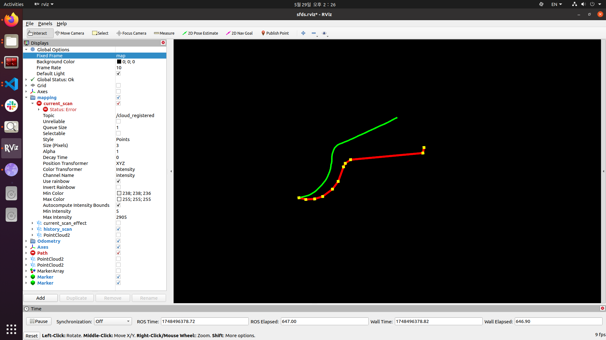

# Global Path Planner - global_path_planner

## 기능 요약
- GPS + Waypoint 기능 제공
- 목적지 입력 시, Kakao API를 활용하여 waypoint 리스트 생성
- Waypoint 도달(5m 이내) 시 자동 삭제
- ROS Topic 기반의 Publisher/Subscriber 구성
- FasterLIO SLAM 기반 실시간 궤적 추정 및 시각화
- Bag 파일 데이터(IMU + LiDAR)를 활용한 오프라인 경로 분석

---

## 작업 이력

### 3월 12일
- gps_server.py로 웹 프롬프트 제공
- Waypoint 접근 시 삭제 로직 구현
- ROS 토픽 구조 설계 (/waypoints 등)

### 3월 13일
- gps_publisher.py 및 기능 보완
- 자바스크립트 수정
  - 목적지 검색창 제거
  - waypoint 및 목적지 좌표를 ROS 토픽으로 전송

### 5월 29일
- FasterLIO 연동을 통한 SLAM 기반 경로 시각화 추가
- Bag 파일 자동 재생 및 GPS 원점 추출 기능
- RViz를 통한 실시간 궤적 및 Global waypoints 시각화
- UTM 좌표 변환을 통한 GPS-SLAM 좌표계 통합

---

## 시스템 구성

### 핵심 컴포넌트
1. **FasterLIO SLAM**: LiDAR + IMU 기반 실시간 위치 추정
2. **GPS 원점 추출**: Bag 파일에서 첫 번째 GPS 좌표를 시작점으로 설정
3. **Kakao API 연동**: 웹 인터페이스를 통한 경로 계획
4. **좌표계 통합**: UTM 변환을 통해 GPS waypoints와 SLAM 궤적을 동일 프레임에서 시각화

### 데이터 흐름
```
Bag 파일 (IMU + LiDAR) → FasterLIO → /Odometry → RViz 시각화
     ↓
GPS 원점 추출 → /gps_data → 웹서버 → Kakao API → /waypoints → RViz 시각화
```

---

## 사용 방법

### 기본 실행 (웹 인터페이스)
```bash
rosrun global_path_planner gps_server.py
rosrun global_path_planner gps_publisher.py
rostopic echo /waypoints
```

### SLAM 기반 경로 시각화 (5월 29일 추가)
```bash
# 1. FasterLIO SLAM 실행
roslaunch faster_lio mapping_ouster32.launch

# 2. 경로 시각화 노드 실행 (Bag 파일 자동 재생 포함)
rosrun global_localization path_visualizer.py

# 3. 카카오맵 웹서버 실행
rosrun global_localization gps_server.py
```

### 한 번에 실행
```bash
roslaunch global_path_planner my_nodes.launch
```
※ 디버깅을 위해서는 개별 실행을 권장함

---

## 시각화 결과

### 1. ROS 노드 구성 (rqt_graph)


시스템의 전체 노드 구성

### 2. RViz 경로 시각화


- **초록색 선**: FasterLIO SLAM으로 추정한 실시간 궤적
- **빨간색 선 + 노란색 큐브**: Kakao API로 받아온 Global waypoints
- **좌표계**: UTM 변환을 통해 GPS와 SLAM 좌표를 통합하여 표시

---

## 주요 토픽

| 토픽명 | 메시지 타입 | 설명 |
|--------|-------------|------|
| `/Odometry` | nav_msgs/Odometry | FasterLIO SLAM 결과 |
| `/gps_data` | std_msgs/String | GPS 원점 좌표 (JSON) |
| `/waypoints` | std_msgs/String | Kakao API 경로 (JSON) |
| `/fasterlio_path` | visualization_msgs/Marker | SLAM 궤적 시각화 |
| `/global_waypoints` | visualization_msgs/Marker | GPS waypoints 시각화 |

---

## 기술적 특징

### GPS-SLAM 좌표계 통합
- Bag 파일의 첫 GPS 좌표를 UTM 원점으로 설정
- FasterLIO의 odom 프레임과 GPS waypoints를 동일한 좌표계에서 표시
- 실시간 TF 브로드캐스트 (map ↔ odom)

### 자동화 기능
- Bag 파일 자동 재생 및 GPS 원점 추출
- 1m 이상 이동 시에만 궤적 포인트 저장 (메모리 최적화)
- 웹 브라우저 자동 실행

---

## 기타 사항
- /waypoints 토픽을 통해 RViz에서 시각화 가능
- GPS 수신 기반이라 야외 주행을 위한 기반 기능임
- Bag 파일 기반 오프라인 분석 및 실시간 SLAM 모두 지원
